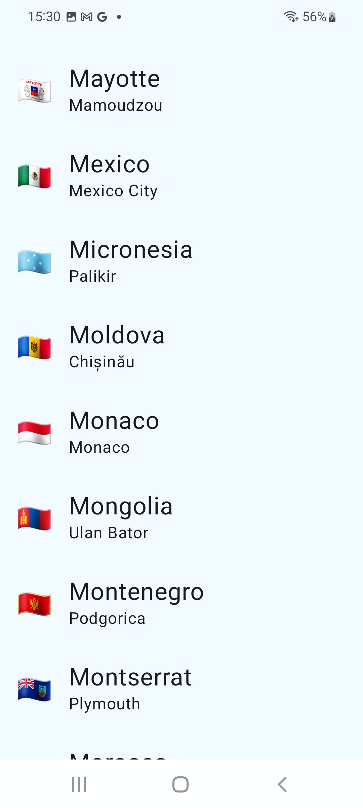
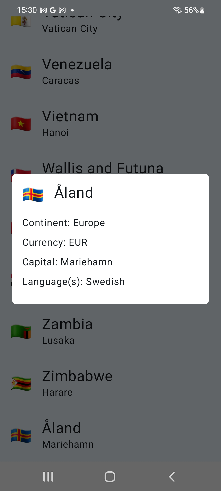

# **Atlas-Countries** 🌍

Atlas-Countries is a mobile application that allows users to browse and explore details about different countries around the world.

## **Features**

- 🗺️ **Country List:** View a comprehensive list of countries.
- 📄 **Country Details:** Get detailed information such as:
  - Population  
  - Capital  
  - Region  
  - Subregion  
  - Country Code  
  - Native Name  
  
## **Screenshots**  

Image #1            |  Image #2               
:-------------------------:|:----------------------------:
    |     

## **Installation**

1. Command to generate schema:
   ```bash
   ./gradlew :app:downloadApolloSchema --endpoint='https://countries.trevorblades.com/graphql' --schema=app/src/main/graphql/com/artemissoftware/schema.graphqls
